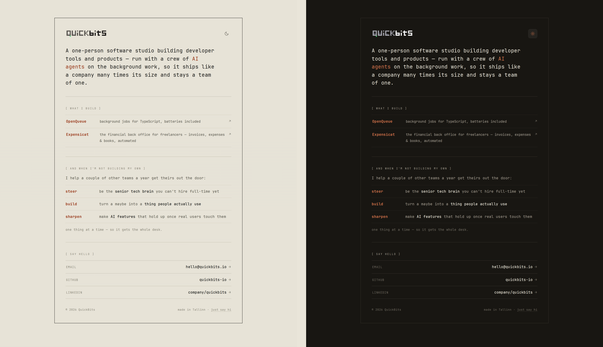

# QuickBits

The [QuickBits](https://quickbits.io) landing page — a single, hand-written static page with **no framework and no build step**, tuned for the fastest possible load and deployed on **Cloudflare Pages**.

It doubles as a tidy, copy-pasteable template for a fast personal/studio page: one HTML file, self-hosted subset fonts, light/dark themes, and edge caching out of the box.



[](https://deploy.workers.cloudflare.com/?url=https://github.com/quickbits-io/site)
[](LICENSE)

## Highlights

- **Zero frameworks, zero runtime JS for content.** Just HTML + inline CSS. The only script is the theme toggle (progressive enhancement) — the page works fully with JavaScript disabled.
- **No third-party requests.** No font CDN, no analytics, no trackers — one origin only.
- **Self-hosted, subset fonts.** JetBrains Mono 400/500/700, cut to Latin + punctuation + arrows and re-packed as WOFF2: ~270 KB/weight → ~13 KB/weight.
- **Light & dark themes** with a no-flash inline boot script and a circular view-transition toggle.
- **Inlined logos.** Both theme wordmarks are inlined as data-URIs, so the first paint needs only the HTML — no round-trips for above-the-fold content.
- **Edge-ready.** Caching + security headers (CSP, HSTS, etc.) via `public/_headers`.
- **Accessible & SEO-ready.** Semantic markup, `prefers-reduced-motion` support, Open Graph/Twitter cards, manifest, `robots.txt`, `sitemap.xml`.

The whole page is a ~27 KB HTML document plus ~40 KB of fonts, all from one origin, Brotli-compressed and HTTP/3-multiplexed at Cloudflare's edge.

## Quick start

Requires [Bun](https://bun.sh).

```bash
bun install        # installs wrangler (the only dependency)
bun run dev        # → http://localhost:8788  (wrangler pages dev, applies _headers)
```

No build is needed — the site is the static contents of `public/`. Any static
server works for a quick look (`bunx serve public`), but only `bun run dev`
emulates the `_headers` rules.

## Make it yours

Everything lives in `public/`:

- **Content** — edit `public/index.html` (the lede, product rows, services, contact links, footer).
- **Colours** — the palette is CSS custom properties at the top of the `<style>` block: `--paper`, `--ink`, `--accent`, … with a `:root[data-theme="dark"]` override.
- **Logo / brand** — replace the files in `public/brand/`. The masthead wordmark is inlined into `index.html` as a data-URI; after changing it, either re-inline the SVG or point the `.logo` rule back to `url("/brand/quickbits-wordmark-light.svg")`.
- **Fonts** — drop your own WOFF2 into `public/fonts/` and update the `@font-face` rules, or re-run the subsetter (see below).
- **Domain** — the canonical URL, `og:*` tags, `robots.txt`, and `sitemap.xml` assume `https://quickbits.io/`. Update them for your domain.

> Forking this? Please swap out the QuickBits brand assets in `public/brand/` — they're trademarks and aren't covered by the MIT license. See [LICENSE](LICENSE).

## Deploy to Cloudflare Pages

Pick one. All serve the contents of `public/`.

### Option A — Git integration (simplest)

Cloudflare dashboard → **Workers & Pages → Create → Pages → Connect to Git**, pick this repo, and set:

- **Build command:** *(leave empty)*
- **Build output directory:** `public`
- **Production branch:** `main`

Cloudflare then builds & deploys on every push, with preview deployments for other branches. Nothing else needed in the repo.

### Option B — Bun + Wrangler (manual)

```bash
bun install
bunx wrangler login
bun run pages:create     # one-time: create the "quickbits-site" Pages project
bun run deploy           # upload public/ as a deployment
```

### Option C — GitHub Actions (CI on push to main)

`.github/workflows/deploy.yml` builds with Bun and deploys on every push to `main`. Add two repository secrets (**Settings → Secrets and variables → Actions**):

| Secret | Where to get it |
| --- | --- |
| `CLOUDFLARE_API_TOKEN` | My Profile → API Tokens → Create Token → *Cloudflare Pages: Edit* |
| `CLOUDFLARE_ACCOUNT_ID` | Workers & Pages overview, right-hand sidebar |

Create the project once (`bun run pages:create`, or it's created by the first dashboard/CLI deploy) before the first CI run. Use **Option A or C, not both**, to avoid double deploys.

### Custom domain

After the first deploy: Pages project → **Custom domains** → add `quickbits.io` (and `www`). If the domain's DNS is already on Cloudflare, records are added automatically and TLS is provisioned for you.

## Project structure

```
public/                      # ← the deployed site (Cloudflare "build output directory")
  index.html                 # the page: inline CSS + inline JS + inlined logos
  _headers                   # caching + security headers
  site.webmanifest           # PWA manifest
  robots.txt  sitemap.xml    # SEO
  brand/                     # favicon set, icons, wordmark sources
  fonts/                     # subset JetBrains Mono (woff2)
scripts/optimize-fonts.sh    # regenerate the font subset
wrangler.toml                # Cloudflare Pages project config
package.json                 # dev / deploy scripts (bun + wrangler)
.github/workflows/deploy.yml # CI deploy on push to main
docs/preview.png             # the preview image above
```

## Regenerate the fonts

```bash
pip install fonttools brotli
bun run fonts        # → public/fonts/jetbrains-mono-{400,500,700}.woff2
```

Edit the `RANGE` in `scripts/optimize-fonts.sh` if the copy starts using characters outside the current subset (anything missing falls back to the system monospace).

## Why no framework?

For one static page, a framework (React/Next/Vue/…) would only add a JS runtime, hydration, and a build pipeline — all of which work against load time. The fastest page is hand-written HTML with its critical CSS inlined, served as static files from a CDN edge. That's what this is.

## Contributing

Issues and PRs are welcome — typo fixes, accessibility improvements, and performance tweaks especially. Keep it dependency-free and framework-free; the whole point is that this stays a single fast page.

## Credits

- Typeface: [JetBrains Mono](https://www.jetbrains.com/lp/mono/) (SIL OFL 1.1)
- Hosting: [Cloudflare Pages](https://pages.cloudflare.com/)

## License

[MIT](LICENSE) for the source code. The QuickBits name, logo, and wordmark are trademarks and are **not** covered by the license — replace them if you fork. JetBrains Mono is under the SIL Open Font License 1.1.
